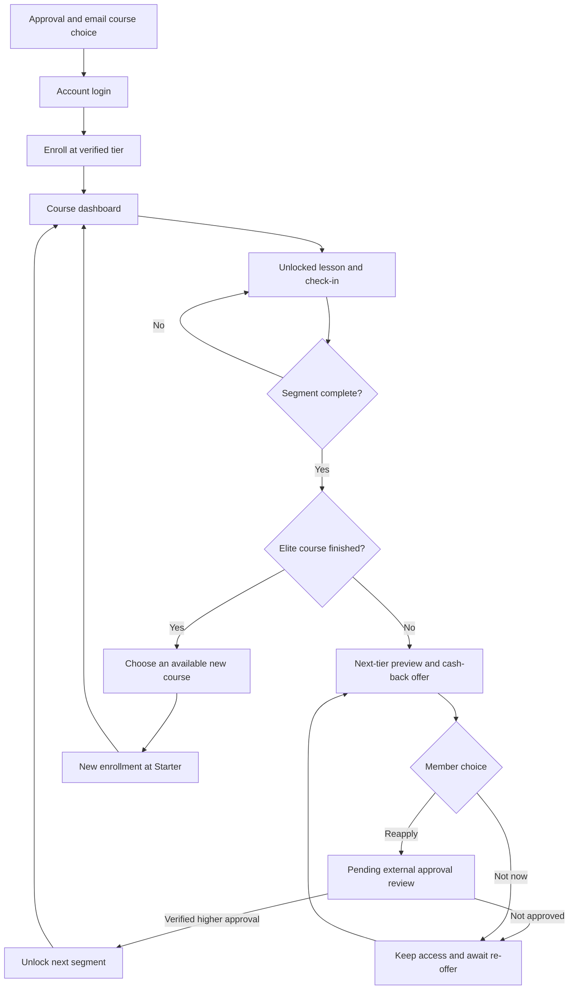

# Architecture and delivery rules

## Design thesis

Wealthsimple-inspired financial confidence, Maven-inspired visible curriculum, and Linear-inspired navigation discipline. The original Credit Pulse palette and heartbeat identity remain. Off-white reading surfaces have comfortable line lengths; translucent navigation and membership panels add depth without putting body copy over blur. Hover states, small entrance animations, progress transitions, and completion badges respect prefers-reduced-motion.

## Sitemap

| Route                                 | Purpose                                                                                   |
| ------------------------------------- | ----------------------------------------------------------------------------------------- |
| /                                     | Redirect to login or the appropriate signed-in home                                       |
| /login                                | Account access; supports optional ?course=credit-mastery&tier=Silver invitation context   |
| /dashboard                            | Current course, tier ladder, progress, deadline, Savings Book, six visible segment panels |
| /courses                              | All six courses and their readiness state                                                 |
| /course/[courseId]/lesson/[lessonId]  | Entitlement-checked reading, quiz, reflection, and bookmarks                              |
| /course/[courseId]/segment/[segment]  | Open segment or locked preview; segment is 1–6                                            |
| /course/[courseId]/complete/[segment] | Completion and cash-back request; protected by actual lesson completion                   |
| /course/[courseId]/finished           | Elite completion and new-course options                                                   |
| /savings                              | Account reflections, approved levels, saved lessons, print view                           |
| /help                                 | Access and progression answers                                                            |
| /admin                                | Operations overview                                                                       |
| /admin/members                        | Search and create member accounts                                                         |
| /admin/members/[memberId]             | Enrollment history and password reset                                                     |
| /admin/curriculum                     | All six courses; ?course selects the curriculum                                           |
| /admin/curriculum/[lessonId]          | Edit lesson sections, quiz, sources, and publication                                      |
| /admin/approvals                      | Pending reviews and nurture history                                                       |
| /admin/settings                       | Confirmed deadlines, bonus copy, Savings Book description, support email                  |

## Tier model

Tier indices are Starter=0, Silver=1, Gold=2, Platinum=3, Diamond=4, Elite=5. Lesson access is allowed when lesson.tier <= enrollment.tier. Approval is stored per course enrollment, so beginning another course at Starter does not change a completed course’s Elite access.

Course completion is independent of entitlement. A Silver member may revisit all Starter lessons and work through Silver. All six milestones stay visible. Badges are earned from completed segments, not merely from approved access.

The uploaded “THE STRUCTURED COURSES” PDF is the source of truth. All titles and tier mappings are copied into content/curriculum.json, with one lesson ID per topic.

| Course             | Lessons | Starter | Silver | Gold  | Platinum | Diamond | Elite |
| ------------------ | ------- | ------- | ------ | ----- | -------- | ------- | ----- |
| Credit Mastery     | 20      | 1–4     | 5–8    | 9–11  | 12–14    | 15–17   | 18–20 |
| Money & Budgeting  | 20      | 1–4     | 5–8    | 9–11  | 12–14    | 15–17   | 18–20 |
| Benefits & Support | 30      | 1–5     | 6–10   | 11–15 | 16–20    | 21–25   | 26–30 |
| Tax & Wealth       | 20      | 1–4     | 5–8    | 9–11  | 12–14    | 15–17   | 18–20 |
| Income & Business  | 20      | 1–4     | 5–8    | 9–11  | 12–14    | 15–17   | 18–20 |
| Health & Fitness   | 30      | 1–5     | 6–10   | 11–15 | 16–20    | 21–25   | 26–30 |

The PDF's sixths describe tier milestones. Lesson-count completion uses actual lessons; for example, Silver Credit Mastery has eight of twenty lessons accessible, while two of six tier milestones are open. Do not reinterpret uneven segments as equal lesson counts.

All courses are structurally ready to select. In real-account mode, only the original credit-score lesson is initially published; the other 139 bodies remain drafts. Demo mode publishes clearly labelled templates to allow a complete delivery-flow review. Every course's curriculum can be inspected and edited by the administrator. Descriptive segment headings are editorial additions, not extra business rules.

## Delivery flow

## Data and authentication

- app/ contains Next.js pages and three route-handler endpoints.
- components/ contains reusable interface elements and browser forms.
- content/curriculum.json contains the approved structure; lib/catalog.ts provides access/completion helpers.
- content/credit-score-lesson.json preserves the original first lesson; lib/content.ts provides its typed content and honest templates.
- lib/view.ts resolves edited lesson titles for curriculum views.
- lib/store.ts implements the temporary demo adapter and persistent PostgreSQL adapter.
- lib/auth.ts reads server sessions and checks role/access at pages and API endpoints.
- scripts/schema.sql defines accounts, hashed sessions, content overrides, settings, audit events, and rate-limit counters.

Passwords use a random salt and Node scrypt. The session cookie contains a cryptographically random token; the database stores its SHA-256 digest, not the raw token. Cookies are HttpOnly, SameSite=Lax, and Secure in production. Mutations require matching Origin and role/entitlement checks. SQL uses parameterized queries. PostgreSQL member updates lock the account row inside a transaction to protect progress and approval changes. Password resets revoke existing sessions. Text content is rendered as React text, not arbitrary HTML.

Administrator checks are performed on each admin page and each mutation endpoint, in addition to the layout. Account data containing hashes is never passed to client components. Member progress and reflections come from the signed-in account. Real-world deployment still requires your operational review, backup policy, privacy documentation, and chosen account-access process.

## API contracts

All mutation requests use POST with Content-Type: application/json and a same-origin browser request.

/api/auth: sign in with email/password and optional courseId, or action=logout.

/api/member: action=enroll, complete, save, reapply, or not-now. The server checks course readiness, the account enrollment, tier access, publication, written answers/acknowledgment or quiz result/reflection, segment completion, and pending-request duplication as appropriate.

/api/admin: action=create-member, review, reset-password, content, or settings. review requires a pending request, a verified reference, and a decision. Approval increases the enrollment by one tier and retains previous completion.

## Business decisions still open

1. The complete bodies and publication schedule for the remaining 139 lessons. Counts and tier assignments are now confirmed by the supplied PDF.
2. Approval-to-tier mapping from the cash-back provider, including approvals that skip multiple tiers. The current review flow advances one tier.
3. Deadline length, when the clock starts, and the exact meaning of keeping a cash-back rate. The demo uses seven days; real-account mode has no deadline until configured.
4. Bonus amounts, eligibility, late completion, and re-offer timing. The UI displays confirmed copy; it does not calculate or issue money.
5. The actual Master Savings Book benefit catalogue. The starter displays available levels and saved learning actions, with no invented savings amounts.
6. Whether an initial higher-tier member receives offers after earlier unlocked segments. This implementation advances at the highest currently approved segment; earlier segment completions lead into already-open lessons.
7. Course-choice locking and any customer-support override process.
8. Written-answer review and reward fulfillment. The original lesson requires all five responses plus acknowledgment; these are stored for review. Other templates require a correct quiz answer and saved reflection. No time-on-page is imposed.
9. The source lesson’s $5 + 20 points reward terms and fulfillment integration. Its wording is preserved, but the app does not automatically grant or pay it.

## Integrations remaining

No email, payment, or cash-back provider is called by this starter. Approval review is manual and explicitly recorded. Not now is stored as a nurture state; automated email and scheduled re-offers need integration.

To add ActiveCampaign, create a server-side integration module and call it after durable enrollment, segment-completion, approval, and Not now mutations. Use an outbox table and a retrying worker rather than sending email inside an open member transaction. Store provider credentials in server-only environment variables. Add idempotent authenticated webhooks for verified approval events; the browser must never set its own tier. Define tag mappings and consent rules with the team before enabling emails.

Keep connection strings and provider secrets out of public environment variables, source files, and GitHub.

## Performance and accessibility

Server components deliver most page content; only forms and navigation controls run client-side. Fonts are bundled locally through @fontsource; no runtime Google Fonts connection is needed. The dashboard does not depend on heavy stock imagery. Curriculum content is fetched in batches and request-scoped course/auth reads are memoized. Motion is CSS-based and disabled under reduced-motion preference. Inputs have labels, primary actions are predictable, drawer navigation supports focus containment and Escape, pages include a skip link, and reading content remains solid and high contrast.

## Content provenance and upgrades

The first lesson's wording is transcribed verbatim from the authenticated course at https://credit-pulse-academy.vercel.app/course/understanding-canadian-credit-scores on 2026-10-02, including the introduction, source links, calculator explanations, Maya's story, all priorities, quick-check answers, five written questions, acknowledgment, reward wording, and ten glossary definitions. Original photographs are replaced by local decorative illustrations; the wording remains. Account name/email are prefilled read-only from the authenticated account. Navigation labels, focus controls, and a reward-confirmation note are additions to support the new delivery model.

The supplied PDF is included at docs/Structured-Courses.pdf. Remaining lesson bodies are templates, not invented finished educational content. New rich reading blocks are validated by lib/content-validation.ts and rendered as React text. Existing database content edits take precedence over bundled defaults. The rich admin editor can restore the supplied original JSON when an older stored override exists.

Existing credit-01 through credit-18 IDs keep their topics; credit-19/20 are added. New tier boundaries can affect prior segment completion and offer records. Review those records before a production upgrade; no automatic irreversible migration or historical reapproval is performed.
